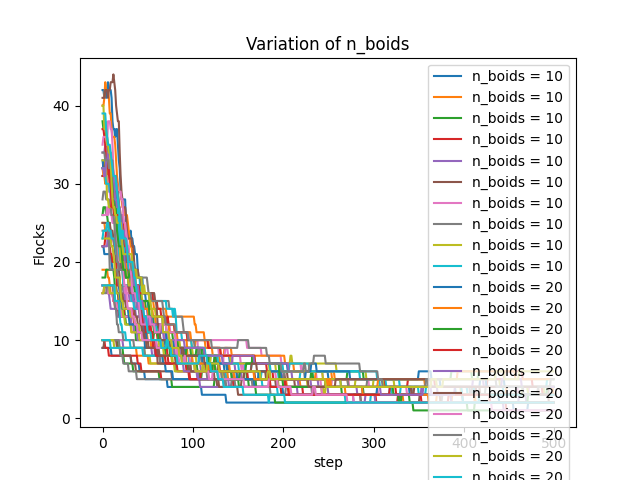
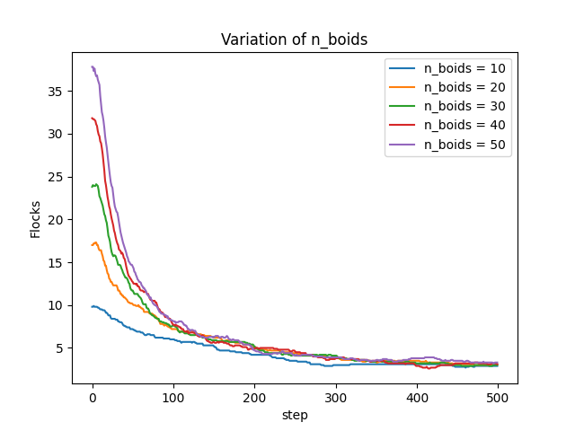

# Assesment
After finishing the project, I am particularly proud of a few methods I have used and some ways to implement the execution of the program. Below I will discuss these per file.

 ## [`helpers.py`](/app/modules/helpers.py)
 This file is the bulk of the program. It envelops all necessary helper functions for executing the program.
 
 
 ### Many small helper functions, a pythonic way to code:
*  `min_norm(list)`: slight expansion upon built-in min() function, returns the scalar value in a list with the smallest norm, rather than the least value.
        * used for calculating get_distance_vector in toroidal space by looking for the smallest distance between options, where negative scalars with a bigger norm than the positive counterpart should not bee seen as 'smaller' since it is the absolute distance that is relevant.
* `normalize(vector)`: returns normalized vector pointing in the same direction as original
* `vector_avg(vectors)`: returns the average point of a list of vectors; for calculating center position
* `rotate_vector(vector)`: applies rotation to vector using linear algebra
* `random_vector(dimensions)`: generates vector with random components between [0, 1) of length `dimensions`.

### Flock counting
I wrote the function `count_flocks(model)`: which uses an efficient algorithm to see which boids belong to a similar flock. It returns an `int` of the amount of flocks present.

An exact way to see which boids belong to which flocks, would be to interpret the boids as points in a graph. If a boid's distance to another boid is less than a certain threshold, the two points are connected in the graph. To count flocks one would then need to see which graphs are disjunct from each other.

Rather than these expensive calculations, I simply start at one boid and add it to the first flock. In the next step I go over all the boids that are not yet added to a flock and inside the loop iterate over the flocks. If the boid is close enough to any boid in any flock, the boid is added to the relevant flock. If it is added to no flock after all, a new flock is instantiated with the boid in it.

### Object collision avoidance
I implemented that the boids can avoid as many user-defined obstacles as is necessary. I was considering different options for defining a _collision_, but ultimately decided to look at the objects as _base_ objects with linear transformations applied to them. For instance any rectangle is simple a square with a matrix applied to it. This also creates the intuition to deal with rotated rectangles. In python it would normally to be hard to confidently, without hardcoding, check when a vector lies within a slanted rectangle's area. If, however you remember the matrix that has ben applied to the square, you can simply apply the inverse matrix to the vector and see if the new vector lies within the original square. This last step is simply a check whether the `x` and `y` coordinate fall in a certain range. Thus a collision is checked by executing `Rectangle.hit(x, y)`, which returns true if the coordinates lie within the rectangle.

Implementing the obstacles as another type of `Agent`, which they theoretically are, caused some issues because of the way Mesa's `Model` class typically executes. I had to write filter functions, so boids only apply their boid-rules to other boids and only apply their object avoidance rules to objects. For this I simply wrote a `filter_type(list, _type, include)` function. It returns only the object within `list` that are of type `_type`. If the optional argument `include` is `False`, it only returns the object that are **not** of type `_type`.

 ### Rewrite of Mesa's ContinuousSpace:
Since Mesa's built-in ContinuousSpace class was only written for 2D implementation and I wasn't looking to built a Space class from scratch, I had to rewrite mesa's version. in [_inspect_module.py](/app/modules/.deprecated/_inspect_module.py) I wrote a tiny script to output mesa's sourcecode for the required module. I exported this to look at the functions that needed a rewrite, which turned out to be roughly all spatial functions. I defined a new class `ContinuousSpace3D` as a child class of `ContinuousSpace`, so it inherits all functions that don't need a rewrite from `ContinuousSpace`. Inside I redefined the functions that needed a rewrite as you can see in [`helpers.py`](/app/modules/helpers.py).

Later I needed to do the same for implementing optional toroidal space in specific functions such as `get_neighbors()`, `get_distance()` and I wrote a new function `get_distance_vector()`. So I also defined a `ContinuousSpacePlus` with as a parent class `ContinuousSpace`, then took `ContinousSpacePlus` as a parent class for `ContinuousSpace3D`.

### Animation class
From previous projects I have very much disliked the hard-code nature of implementing matplotlib, where you almost always have to write a different plotting code for a different type of plot. Especially for animations. With animations it also comes with additional required animation functions that only work if they return the type of objects Matplotlib wants from them. To bypass a lot of hard-coding, I wrote an `Animation` class for the boids animations, which handles both 2D and 3D animations without any extra functions but merely some extra if-statements for defining certain parameters. The class takes arguments for 2D or 3D animation, prerendered data **and** realtime animation, all piping to the `.update_plot()` internal function. This way I as little code twice as possible.

### Reading from configuration file
Another vision I had is that I wanted to make the program generally as modular as possible. Meaning I wanted the user to be able to run the program in many different ways without ever having to change anything to the code. Thus I added many command-line options what trickle down to completely different simulations, but these could quickly become annoying to retype each time. Thus I implemented an option for reading the configuration from a `.json` file. 

## [`main.py`](app/main.py)
The code in this file serves as a general interface for executing the simulation with different configurations. I wanted to be able to run the file without any required commandline options so I implemented a default value for each option. This way there's a 'default' way to run the simulation, which serves as a basis upon which the user can apply different settings. Otherwise each execution of `main.py` would require quite a long string of arguments which would also make debugging more tedious. Commandline arguments can do the following:
* Change the number of boids
* Change the x-dimension of the box that the boids fly within
* Change the y-dimension of the box that the boids fly within
* Change the z-dimension of the box that the boids fly within, entering `-z 0` disables the z-dimension and results in a two-dimensional simulation.
* The number of iterations
* Choose between running the simulation with or without any animation (turn this off if you are only looking after the simulation data)
* Choose to show the animation or not (convenient when running multiple simulations where saving the animation to a GIF is the goal)
* Choose to save the animation or not
* Choose to run the simulation and animation in realtime/concurrently. If not, the program will render the data first and then run the animation. This option is convenient when trying out different parameter values, because you can directly see the effect without waiting for the render. However, saving the data is so far not possible with a realtime animation.
* Choose to cache the data (convenient when you wish to replay the same simulation)
* Choose a configuration file: this overwrites commandline options with values from a `.json` file. Notably options that are not present in the `.json` file will not be overwritten. An example is [`default_config.json`](app/config/default_config.json)

## [`repeat.py`](app/repeat.py)
The code in this file has very much the same purpose as [`main.py`](app/main.py), in that it primarily serves as an interface to execute the simulation. This version, however, executes the program with the same configuration multiple times. This is required if one is interested in net values or statistics about the simulation, where _one_ run of the simulation would be statistically insignificant. By default, it runs the simulation without caching, because otherwise each simulation with the same configuration would return the same data. It then has the option to plot the flock counts per iteration step. Commandline options can do the following:
* Choose the amount of repeats for a given configuration (default = 1)
* Choose to save the outputted data to a `.csv` file
* Choose a configuration file (the default is [`repeat_config.json`](app/config/repeat_config.json))
* Choose to render a plot or not (convenient when executing the repeats with different configurations and you are not intersted in each seperate plot)

Many repeats means many executions of the same code after each other. To save a lot of time, I made use of the `multiprocessing` python library to speed up the process by a factor basically equal to the number of threads that the user's computer has available. It creates multiple instances of the python kernel in different threads in which the simulations will be run _concurrently_ rather than _succesively_. Apparently this method does share some memory like the `np.random` seed. Implementing this required resetting the `random` seed with each instance, because otherwise the simulations would be run with exactly the same starting positions and directions of the boids, resulting in identical data. This is why in `random_vector()` I didn't use `np.rand()`.

## [`compare.py`](app/compare.py)
Again the code in this file serves as another interface. [`compare.py`](app/compare.py) gives the user the ability to easily execute [`repeat.py`](app/repeat.py) with a range of configurations. It takes the required argument `key`, which is the key to the parameter in the configuration dictionary that will be altered with each execution of [`repeat.py`](app/repeat.py). It also takes the required argument `-r` which defines the values for `key` to be tried. For example entering `python3 compare.py n_boids -r 5 10 20` executes [`repeat.py`](app/repeat.py) with 5 boids, 10 boids and 20 boids succesively. Commandline options can do the following:
* Direct the program to the `key` to the parameter that will take different values
* Input a range of values for the parameter to take
* Choose a _base_ configuration file, of which only `key` will be altered (the default is [`compare_config.json`](app/config/repeat_config.json))
* Choose the number of repeats per value of `key`
* Change the path that the outputted plot will be saved to
* Choosing to not take averages. Meaning the program by default takes the average data of all repeats per value of `key`. This way the data per different value of `key` will be less noisy. Running `plot_model_data` with the argument `take_avg=False` is completely possible and results in a plot like this:

Where leaving `take_avg` to its default value of `True` generates a plot like this:

## Honorable mentions:
* Smart Pickle caching
    * I wrote a function wrapper (`@pickle_cache`) that takes the function's `args` and `kwargs`, hashes that information to a string and outputs the function's output to a `.pkl` file. When the function is run with the same positional arguments and keyword arguments, it recognizes the arguments after hashing and instead of running the function, retrieves the data from the cache (`.pkl` file).
    * Also added option to ignore cached files/to not cache data.
* tqdm for big calculations: convenient progress bar for impatient people.
    * hacky fix for multithreaded simulations by altering position of tqdm bar
* Almost no hardcoding, except for animation lay-out. Even switching between 2D and 3D uses almost all of the same functions, without necessary additional parameters other than the z-dimension of the box.
* Pythonic use of classes for `Obstacles` and its child classes and `Flock`.
* prerendering **and** realtime rendering without much hassle on the user-side. It just runs.