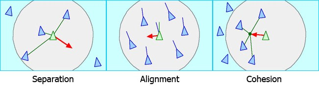

# Project Proposal

###### Source: https://github.com/IvanHornung/Pandemic-Simulator

Student name: Laszlo Schoonheid

Student number: 11642610

---

## Goal

To simulate the flocking behaviour of birds. It is an example of emergent behaviour of simple rules, for example the birds must achieve:
- Flying in the same general direction (alignment)
- Collision avoidance (separation)
- Stick together (cohesion)

###### Source: http://www.red3d.com/cwr/boids/

### Optional goals:
- Three-dimensional expansion
- Altitude management (fly horizontally)
- Obstacle avoidance
- Implement pickle
- Different bird types/flock types
- Predator chasing and avoidance (e.g. a shark VS. a school of fish)
- Looking for food
- Multiprocessing/hardware acceleration for faster simulation
- Realtime interaction (e.g. moving object, placing birdfeed)
- Implement Tkinter

---

## Solution sketch

All user input will be inputted through the commandline. The user shall be able to
choose the amount of birds, timecap, rule (de)selection and possibly more if time permits.
I also aim to make a `config.ini` file where settings can be adjusted.

### Required tools/libraries:
- Mesa
- Matplotlib
- Numpy
- ArgParse
- Multiprocessing
- TQDM

### Inspiration:
- https://github.com/topics/boids
- http://www.red3d.com/cwr/boids/
- "Coding Adventure: Boids" - https://www.youtube.com/watch?v=bqtqltqcQhw
- "Neat AI does Predator Boids" - https://www.youtube.com/watch?v=rkQB4zEJggE
- "Neat AI does QuadTree Boids" - https://www.youtube.com/watch?v=TrrbshL_0-s
- https://github.com/projectmesa/mesa-examples/tree/master/examples/Flockers

### Hardest parts
I presume the hardest facet of this project will be computational efficiency. 
The more birds are simulated, the more complex the interactions will be and more
tricks will be needed to speed up the process.