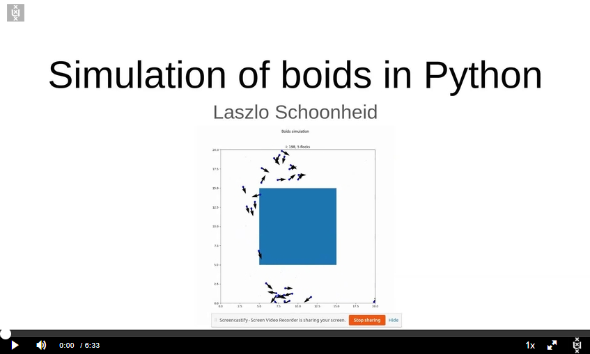

# Simulating boids
By Laszlo Schoonheid

---

An implementation of [Craig Reynolds' Boids flocker model](https://nl.wikipedia.org/wiki/Boids). The goal is to simulate the flocking behaviour of birds. This is an example of emergent behaviour with simple rules, for basic rules are:
- Flying in the same general direction (alignment)
- Collision avoidance (separation)
- Stick together (cohesion)

###### Source: http://www.red3d.com/cwr/boids/
This program also includes the option to make the boids avoid obstacles, to execute the simulation multiple times concurrently adn gather data and to compare the effect of different parameter values.

# Installation
To install all required packages, run

    pip install -r app/requirements.txt

# How to run
For proper execution, you need to first change directories:

    $ cd app

## Default
The simplest way to execute the program is to run

    $ python main.py

This runs the simulation with a default configuration and displays a plot. An example:

### Options
main.py accepts the following optional commandline arguments:

    -n N_BOIDS            number of boids
    -x X                  x-dimension of box
    -y Y                  y-dimension of box
    -z Z                  z-dimension of box
    -i I_MAX              Number of iterations
    --noanim              Simulate without generating animation
    --noshow              Simulate without showing animation
    --realtime            Simulate in realtime
    --savefig ANIM_PATH   Save animation to GIF. Usage: --savefig NAME.gif
    --savedata DATA_PATH  Save data to CSV. Usage: --savedata NAME.csv
    --nocache             Run simulation without caching output data
    --config CONFIG_PATH  Configuration file for simulation.

### Collision avoidance
To run the program with collision avoidance enabled, simply define some objects to avoid in a configuration file. En example of such a file can be found [here](app/config/obstacle_config.json). Such a simulation looks like this:

## Repeat
To repeat the same simulation multiple times, for example to gather data, run

    $ python repeat.py -i REPEATS

A single repeat by default measures the amount of flocks per iteration. Ten repeats would be outputting a plot like this:

### Options
repeat.py accepts the following optional commandline arguments:

    -i REPEATS      Number of times to repeat simulation. Usage: -i [i]
    -o OUTPUT       Output csv file. Usage: -o output.csv
    -c CONFIG_PATH  Input configuration file. Usage: -i config.json
    --nofig         Simulate without generating figure

## Compare
To compare the effect of different parameter values on the amount of flocks over time, the interface `compare.py` can be executed by running

    $ python compare.py KEY -r RANGE

For example, running 

    $ python compare.py n_boids -r 5 10 20 40

would output a plot like this:

### Options
compare.py accepts the following optional commandline arguments:

    -r VAR_RANGE [VAR_RANGE ...]    Parameters to try for `key`
    -c CONFIG_PATH                  Input base configuration file. Usage: -i config.json
    -i REPEATS                      Set number of times to repeat simulations per parameter.
    -o OUTPUT                       Set number of times to repeat simulations per parameter.
    --noavg                         Generate plot without taking averages.

# Important files

* [app/main.py](app/main.py) Interface for executing a single simulation
* [app/repeat.py](app/repeat.py) Interface for repeating simulations
* [app/compare.py](app/compare.py) Interface for comparing the effect of parameter values
* [app/modules/helpers.py](app/modules/helpers.py) Includes all helper functions for executing the program
* [app/config/](app/config) Directory containing some default configurations for the program
* [app/outputs/](app/outputs) Directory containing outputted figures and animations of simulations

# Acknowledgements
* Code in [app/modules/.deprecated](app/modules/.deprecated) has been copied from Mesa's `space` module.

# Screencast

[](https://api.eu.kaltura.com/p/120/sp/12000/embedIframeJs/uiconf_id/23449960/partner_id/120?iframeembed=true&playerId=kaltura_player&entry_id=0_vbzkwyey&flashvars[streamerType]=auto&amp;flashvars[localizationCode]=en_US&amp;flashvars[leadWithHTML5]=true&amp;flashvars[sideBarContainer.plugin]=true&amp;flashvars[sideBarContainer.position]=left&amp;flashvars[sideBarContainer.clickToClose]=true&amp;flashvars[chapters.plugin]=true&amp;flashvars[chapters.layout]=vertical&amp;flashvars[chapters.thumbnailRotator]=false&amp;flashvars[streamSelector.plugin]=true&amp;flashvars[EmbedPlayer.SpinnerTarget]=videoHolder&amp;flashvars[dualScreen.plugin]=true&amp;flashvars[hotspots.plugin]=1&amp;flashvars[Kaltura.addCrossoriginToIframe]=true&amp;&wid=0_2u7qgrq5)